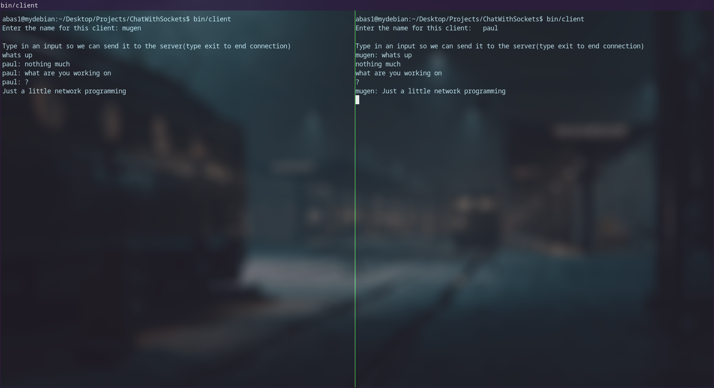

# **Chat over Sockets!**

Using the socket api, this project simulates a CLI chat room application



## Build Requirements
* C++ version C++17 and up
* Linux/macOS: Ensure g++ is installed
* make must be installed for building

### Even though this is written in C++ we still need the C header files to work with sockets as it is used in this project

to install the nessesary header files, run 

```
sudo apt update
sudo apt upgrade
sudo apt install build-essential
```

### Running the server and clients

```
mkdir bin/
bin/server 127.0.0.1 2000
bin/client
```

### Additional information
* If you want to change were the host is at, you must edit the port and host inside of the clients constuctor
* This will work on Linux/Os systems, not sure about windows

